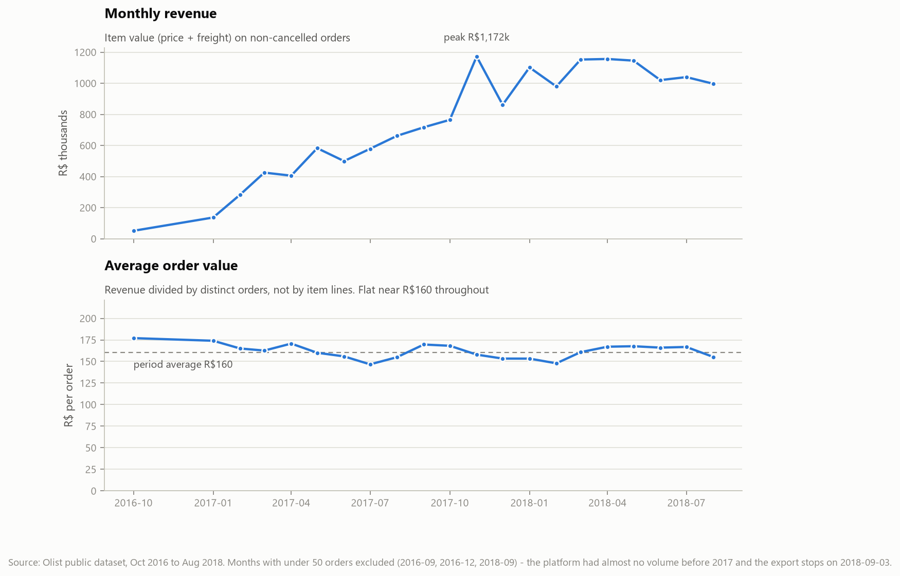
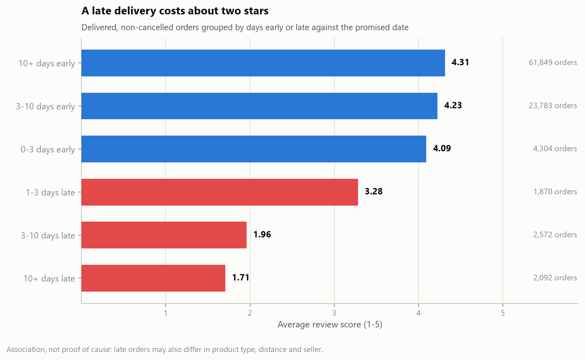
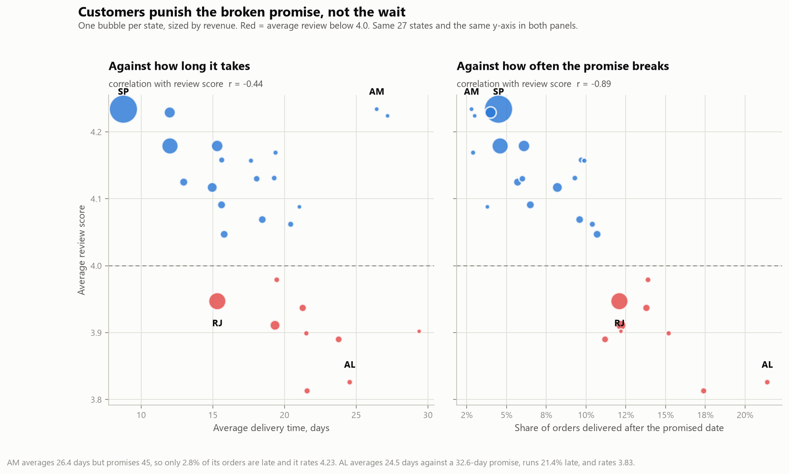
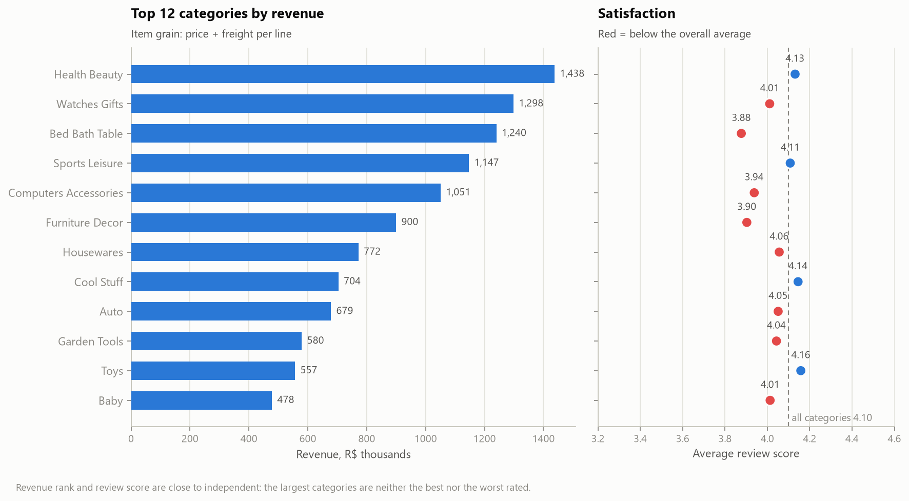

# RetailLens: what drives satisfaction on a Brazilian marketplace

**Dataset:** Olist public e-commerce export, 2016-09-04 to 2018-09-03
**Scope:** 98,207 non-cancelled orders · 112,101 item lines · R$15.7M · 94,990 customers
**Every figure below is reproduced from raw tables by `sql/04_reconciliation.sql`.**

---

## Summary

Olist's delivery operation is not slow. It is inconsistent, and inconsistency is
what customers rate.

Average delivery takes **12.6 days** against a promise of **23.7** — an 11-day
buffer. Only **6.8%** of delivered orders miss the promised date. But those 6.8%
generate **36.5% of all one-star reviews**, and an order that arrives late scores
**2.26 stars against 4.28** for one that does not: a gap of **2.0 stars**.

The crucial detail is *which* delivery metric predicts satisfaction. Across
Brazil's 27 states, average delivery time explains satisfaction weakly
(r = −0.44). The share of orders that miss the promised date explains it strongly
(**r = −0.89**). Amazonas takes 26 days and is rated 4.23; Alagoas takes 24 days
and is rated 3.83. The difference is not speed — it is that Amazonas promises 45
days and Alagoas promises 33.

**Customers do not punish waiting. They punish being told the wrong date.**

That reframes the problem. Cutting transit time nationally is expensive.
Tightening the accuracy of the delivery estimate is mostly a forecasting change,
and this data says it is the lever that moves the rating.

---

## 1. Sales are growing; order size is not

Revenue grew from roughly R$50k/month in late 2016 to a **R$1.17M peak in
November 2017** (Black Friday), settling around **R$1.0–1.15M** through 2018.

Average order value is flat at **R$160** for the entire period, within a
R$146–177 band, with no trend. Combined with **1.14 items per order**, growth is
coming almost entirely from **order count**, not from basket size.

The retention picture is thin: only **3.0%** of customers ever place a second
order. For a marketplace this is a structural fact rather than a failure — buyers
come for a product, not for the platform — but it does mean revenue growth is
bought entirely through acquisition. Anything that raises repeat rate compounds;
anything that raises AOV has, so far, not moved.

> **Read the trend with care.** Nov–Dec 2016 are effectively missing from the
> export and Sep 2018 holds a single order. Charts exclude months under 50 orders
> rather than draw a cliff that is a collection artefact.

---

## 2. A late delivery costs about two stars

| Delivery outcome | Orders | Avg review | 1-star | 5-star |
|---|---:|---:|---:|---:|
| On time or early | 89,936 | **4.28** | 6.8% | 62.0% |
| Late | 6,534 | **2.26** | 54.2% | 16.3% |

Late orders are **eight times** more likely to draw a one-star review.

The response is not linear — **there is a cliff at three days**:

| | Avg review |
|---|---:|
| 0–3 days early | 4.09 |
| **1–3 days late** | **3.28** |
| **3–10 days late** | **1.96** |
| 10+ days late | 1.71 |

Slipping one to three days costs about 0.8 stars. Slipping past three days costs
another 1.3. Beyond ten days, extra delay barely registers — the customer has
already given the lowest score available. Operationally this matters: a recovery
action worth taking on day 2 is worth far less on day 12.

Late-delivered orders carry **R$1.15M, 7.3% of revenue**.

**Honest bound on the upside.** If late orders somehow rated like on-time ones,
the overall average would move from 4.14 to 4.28 — **+0.14 stars**. The effect per
affected customer is large; the population-level effect is bounded by the fact
that 93% of orders already arrive on time. The case for fixing this rests on the
one-star tail and its effect on future demand, not on the headline average.

---

## 3. The promise matters more than the clock

Two candidate explanations, same 27 states, same y-axis:

| Predictor of state-level review score | Correlation |
|---|---:|
| Average delivery time (days) | −0.44 |
| **Share of orders delivered late** | **−0.89** |

The contrast case is clean:

| State | Avg delivery | Promised | Late rate | Avg review |
|---|---:|---:|---:|---:|
| **Amazonas (AM)** | 26.4 days | 45.3 days | **2.8%** | **4.23** |
| **Alagoas (AL)** | 24.5 days | 32.6 days | **21.4%** | **3.83** |

Nearly identical transit times, opposite outcomes. Amazonas sets an honest
expectation and meets it. Alagoas sets an optimistic one and misses it one time in
five.

São Paulo — **37% of all revenue** — delivers in 8.8 days at a 4.5% late rate and
rates 4.23. Rio de Janeiro delivers in 15.3 days at 12.1% late and rates 3.95, the
weakest of the large states and the clearest single opportunity by revenue.

**The caveat that keeps this honest:** the 11-day average buffer means "on time"
is a soft target. Olist is partly buying its on-time rate with padded promises,
and a padded promise has its own cost — a customer told "23 days" may simply not
order. This analysis can measure the satisfaction side of that trade. It cannot
measure the conversion side, because the data contains no abandoned carts.

---

## 4. Category ratings are not a delivery story

Revenue is concentrated but not dominated: the top 12 of 74 categories carry
68.9% of revenue, led by Health & Beauty (R$1.44M), Watches & Gifts (R$1.30M)
and Bed Bath Table (R$1.24M).

Revenue rank and satisfaction are close to unrelated. Across the 30 categories
with 500+ item lines:

| Against category average review | Correlation |
|---|---:|
| Late rate | −0.51 |
| Freight share of item value | −0.23 |
| Average item price | −0.02 |

Price does not buy satisfaction, and delivery explains less between categories
than it does between states — because delivery outcomes vary far less by category
than by geography.

**The interesting case is Office Furniture**, the worst-rated category at 3.48
with 1,690 item lines:

| | On-time avg | Late avg | Late rate |
|---|---:|---:|---:|
| Office Furniture | **3.61** | 2.29 | 8.0% |
| All categories | **4.20** | 2.24 | 6.6% |

Its late rate is only slightly above average, and its *late* orders rate the same
as everyone else's late orders. The gap is entirely in orders that **arrived on
time** — 3.61 against 4.20. Whatever is wrong with Office Furniture is not
logistics. Bulk, damage in transit, assembly difficulty and expectation mismatch
are all plausible; none can be separated with the fields available.

Bed Bath Table repeats the pattern at scale: third by revenue, 3.88 average,
delivery metrics unremarkable.

---

## Data limitations

1. **Association, not causation.** Late orders may differ systematically in
   product type, distance, seller quality and price. No experiment, no instrument,
   no control for confounders — every claim here is a conditional average. The
   direction is consistent enough across three independent cuts (order, state,
   category) to act on; the magnitude should not be taken as a treatment effect.
2. **Reverse causality is possible in part.** A problem order — a seller who is
   slow to ship, a product out of stock — produces both a late delivery and a bad
   review. The delay may be a symptom of the same root cause as the complaint
   rather than the cause of it.
3. **Payments exceed item value by 1.04%** (R$16.01M vs R$15.84M): installment
   interest and voucher top-ups. All revenue figures use item value. One order has
   no payment record at all and is left NULL rather than imputed.
4. **1,737 orders (1.77%) never reached the customer.** Excluded from delivery and
   review averages rather than counted as on time — a never-delivered order is
   unknown, not successful. Their reviews are, unsurprisingly, poor; including
   them would strengthen the headline, which is why they are excluded.
5. **The published reviews file is inconsistent between mirrors.** The copy used
   here has 100,000 rows and 99,173 distinct review ids, covering every order.
   Duplicates are resolved by keeping the most recently answered review. Review
   percentages here are not directly comparable to Olist write-ups based on the
   ~99.2k-row file with incomplete coverage.
6. **Two years, one platform, one country, ending 2018.** Brazilian logistics,
   Brazilian expectations, pre-pandemic. Nothing here transfers to another market
   without re-testing.
7. **No cost data.** "Revenue at risk" is revenue, not margin. Whether fixing a
   late delivery is worth the freight premium cannot be answered from this data.

---

## What to investigate next

1. **Rebuild the delivery estimate and measure the trade.** The 11-day buffer is
   the central unexamined decision. Model actual transit time by route, set the
   promise at a chosen service level, and quantify what tightening it does to late
   rate — then find the conversion side of that trade, which needs funnel data
   this export does not have.
2. **Take Rio de Janeiro apart.** Second by revenue, 12.1% late against São
   Paulo's 4.5%, at only 6.5 days more transit. Is the gap carriers, seller
   location, or an estimate that was never recalibrated for the route?
3. **Read the Office Furniture reviews.** The review text is in the raw file and
   is unused here. On-time orders rating 3.61 against a 4.20 benchmark is a
   product or expectation problem that the structured fields cannot name, and the
   comment text can.
4. **Model review score properly.** Ordinal logistic regression on delay days,
   category, freight share, price, distance and seller, to separate delivery from
   the factors currently confounded with it. The three-day cliff should be tested
   as a threshold effect rather than assumed.
5. **Quantify the cost of a one-star review.** Only 3% of customers return, so the
   retention channel is weak by construction. The damage is more likely in
   conversion of *future* buyers via public ratings — which requires marketplace
   traffic data to measure, and would turn "2 stars lost" into a number the
   business can price.
